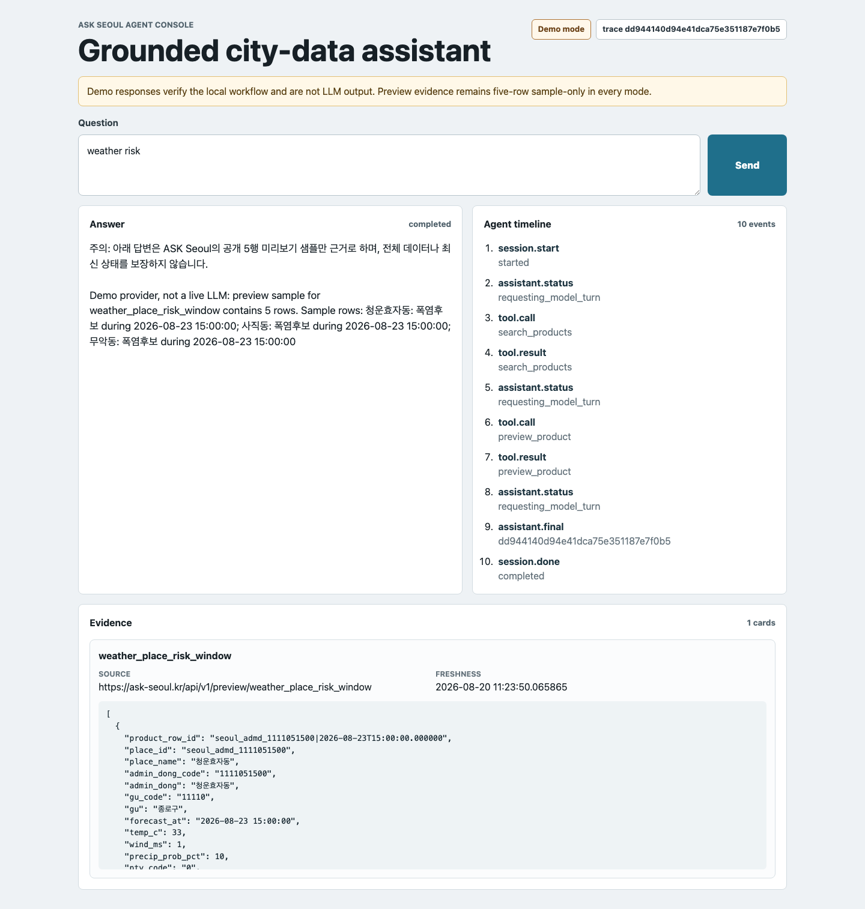
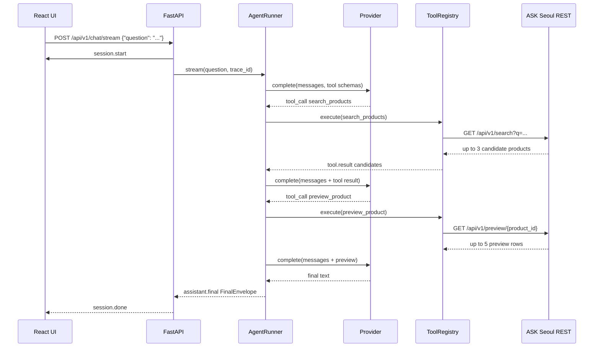

# ASK Seoul Agent

ASK Seoul의 공개 데이터 상품 API를 직접 복사하지 않고, API 계약으로 호출하는 evidence-first AI Agent 서비스입니다. 현재 구현은 FastAPI SSE backend, React console UI, Gemini GenerateContent/Anthropic Messages API adapter, keyless demo provider, ASK Seoul public REST adapter로 구성되어 있습니다.

중요: `demo` provider는 LLM이 아닙니다. 로컬 E2E와 UI 검증을 위한 결정적 provider입니다. 외부 LLM 호출은 로컬 `.env`의 자격 증명과 실행 시 opt-in flag가 모두 있어야 하며, 기본 테스트/CI에서는 실행되지 않습니다.



화면은 `demo` provider가 실제 ASK Seoul public REST의 search/preview를 호출한 live-data smoke 결과입니다. 모델 생성 결과를 캡처한 화면은 아닙니다.

## 60초 설명

이 저장소의 개인 기여 경계는 “ASK Seoul 데이터 상품을 사람이 보는 마켓플레이스에서, 에이전트가 안전하게 소비하는 서비스 계층으로 확장”한 부분입니다.

- 조직 프로젝트의 코드를 복사하지 않고, `https://ask-seoul.kr`의 공개 REST 계약을 client adapter로 통합했습니다.
- 모델이 SQL이나 임의 URL을 만들지 못하게 `search_products`, `preview_product` 두 도구만 allowlist로 열었습니다.
- 답변은 반드시 `preview_product` evidence가 있어야 생성되며, 없으면 `insufficient_data`로 fail-closed 합니다.
- SSE timeline, trace id, provider mode, evidence envelope를 UI와 API에 노출해 면접에서 agent loop와 운영 경계를 설명할 수 있게 했습니다.

## 문제와 해결

문제: 일반 챗봇은 “서울 데이터에 대해 그럴듯하게 답하는 것”은 쉽지만, 실제 데이터 상품 상태, freshness, sample-only 한계, upstream 실패를 구분하지 못하면 운영 서비스로 보기 어렵습니다.

해결: LLM을 직접 데이터베이스에 붙이지 않고, ASK Seoul 데이터 상품 계약을 도구로 감싼 bounded agent를 만들었습니다. 모델은 도구 호출을 선택하고, 서비스는 allowlist, schema validation, request-scoped discovery, timeout, tool budget, evidence envelope로 실행을 제어합니다.

## Architecture

```mermaid
flowchart LR
  U[User / React Console] -->|POST /api/v1/chat/stream| API[FastAPI SSE API]
  API --> RUN[AgentRunner<br/>max_rounds=4<br/>max_tool_calls=4<br/>total_timeout=45s]
  RUN --> P{Provider}
  P -->|demo, not LLM| DEMO[DemoProvider]
  P -->|gemini| GEMINI[Gemini GenerateContent API<br/>function-calling adapter]
  P -->|anthropic| CLAUDE[Anthropic Messages API<br/>tool_use adapter]
  RUN --> TR[ToolRegistry<br/>allowlisted tools]
  TR -->|search_products| SEARCH[ASK Seoul REST<br/>/api/v1/search]
  TR -->|preview_product| PREVIEW[ASK Seoul REST<br/>/api/v1/preview/{product_id}]
  SEARCH --> CTX[Request-scoped discovered product ids]
  CTX --> PREVIEW
  PREVIEW --> EV[FinalEnvelope<br/>answer + evidence + trace_id]
  EV --> API
  API -->|SSE events| U
```



## 현재 구현 범위

| 영역 | 현재 상태 |
| --- | --- |
| Backend | FastAPI, SSE endpoint, health/meta endpoint |
| Frontend | React + Vite console, SSE parser, timeline/evidence panels |
| Provider | `demo`, `gemini`, `anthropic` |
| Tools | `search_products`, `preview_product` |
| ASK Seoul 연동 | public REST search/preview |
| Security headers | CSP, frame deny, no-sniff, referrer policy, permissions policy |
| Observability | package-scoped JSON logger, allowlisted operational fields only |
| Evaluation | versioned 30-case manifest, deterministic release gate, opt-in Gemini/Anthropic live lane |
| MCP/auth query | 아직 미구현, Phase 2 |
| Delivery | multi-stage Docker image, hardened Compose, GitHub Actions CI |
| DB/SQL | 이 repo는 DB를 직접 붙이지 않음. ASK Seoul data product API를 소비하는 agent service |

## Quickstart

### Backend: local `uv`

```bash
cd ask-seoul-agent
uv sync --locked
PYTHONPATH=src uv run --no-sync uvicorn ask_seoul_agent.main:app --host 127.0.0.1 --port 8000
```

검증된 smoke:

```bash
curl -sS http://127.0.0.1:8000/health/live
curl -sS http://127.0.0.1:8000/health/ready
curl -sS http://127.0.0.1:8000/api/v1/meta
curl -sS -N -X POST http://127.0.0.1:8000/api/v1/chat/stream \
  -H 'Content-Type: application/json' \
  -d '{"question":"weather risk preview"}'
```

개발 실행은 checkout의 최신 코드를 확실히 사용하도록 `PYTHONPATH=src`를 명시합니다. 배포 이미지는 editable install이나 `PYTHONPATH`에 의존하지 않고 wheel을 설치합니다.

실제 Gemini mode는 `.env.example`을 참고해 로컬 `.env`에 `AGENT_PROVIDER=gemini`, `GEMINI_API_KEY`, 필요 시 `GEMINI_MODEL`을 설정한 뒤 실행합니다. `.env`는 저장소에 커밋하지 않습니다.

```bash
PYTHONPATH=src uv run --env-file .env --locked uvicorn ask_seoul_agent.main:app --host 127.0.0.1 --port 8000
```

### Frontend: React

```bash
cd ask-seoul-agent/frontend
npm ci
npm run dev -- --host 127.0.0.1 --port 5179
```

Vite dev server는 `http://127.0.0.1:5179/`에서 200 OK를 확인했습니다. 개발 proxy는 `/api`를 `http://127.0.0.1:8000`으로 전달합니다. `npm run build` 후에는 backend가 `frontend/dist`를 같은 origin에서 정적 파일로 서빙합니다.

### Docker

기본값은 keyless `demo` mode입니다.

```bash
cd ask-seoul-agent
docker compose up --build
```

브라우저에서 `http://127.0.0.1:8000/`을 열거나 다음 검증 스크립트를 실행할 수 있습니다.

```bash
make smoke-container
```

이미지는 Node 24 frontend build와 Python 3.12 runtime을 분리하고, wheel을 non-editable로 설치합니다. runtime은 UID 10001의 비-root 사용자로 실행됩니다. Compose는 read-only root filesystem, `/tmp` tmpfs, `cap_drop: ALL`, `no-new-privileges`를 적용하며 `/health/ready`를 healthcheck로 사용합니다. `gemini` 또는 `anthropic` mode에서 해당 key가 빠지면 readiness 503과 unhealthy 상태가 됩니다.

## Environment Variables

| 변수 | 기본값 | 설명 |
| --- | --- | --- |
| `AGENT_PROVIDER` | `demo` | `demo`, `gemini`, `anthropic` 중 하나 |
| `GEMINI_API_KEY` | 없음 | `AGENT_PROVIDER=gemini`일 때 필요. 로컬 secret으로만 관리 |
| `GEMINI_MODEL` | `gemini-2.5-flash` | Gemini GenerateContent API model 이름 |
| `ANTHROPIC_API_KEY` | 없음 | `AGENT_PROVIDER=anthropic`일 때 필요 |
| `ANTHROPIC_MODEL` | `claude-sonnet-5` | Anthropic Messages API model 이름 |
| `AGENT_MAX_CONCURRENT` | `2` | 동시 agent stream 처리 제한 |
| `LOG_LEVEL` | `INFO` | `ask_seoul_agent` package JSON log level |
| `AGENT_EVAL_LIVE` | `0` | `1`일 때만 recorded fixture 기반 외부 LLM 10-case eval 허용 |
| `AGENT_LIVE_E2E` | `0` | `1`일 때만 외부 LLM + live ASK Seoul SSE smoke 허용 |

`demo` mode의 `/api/v1/meta`는 `demo_is_llm: false`를 반환합니다.

## API Contract

### `GET /health/live`

프로세스 생존 확인입니다. 외부 ASK Seoul이나 Anthropic을 probe하지 않습니다.

```json
{"status":"ok","version":"0.1.0"}
```

### `GET /health/ready`

provider 구성 확인입니다. `gemini`/`anthropic` mode에서 선택한 provider의 API key가 없으면 503을 반환합니다. 자격 증명 실패를 `demo`로 묵시적으로 대체하지 않습니다.

```json
{"status":"ready","provider_mode":"demo"}
```

### `GET /api/v1/meta`

UI와 운영자가 현재 mode와 도구 목록을 확인하는 endpoint입니다.

```json
{
  "provider_mode": "demo",
  "ready": true,
  "demo_is_llm": false,
  "tools": ["search_products", "preview_product"]
}
```

### `POST /api/v1/chat/stream`

요청:

```json
{"question":"weather risk preview"}
```

제약:

- `question`: 1-500자
- blank/control character는 422
- 동시 요청이 `AGENT_MAX_CONCURRENT`를 넘으면 429

SSE event:

| event | 의미 |
| --- | --- |
| `session.start` | trace id와 provider mode 시작 |
| `assistant.status` | 모델 turn 요청 상태 |
| `tool.call` | allowlisted tool 호출 입력 |
| `tool.result` | client-safe tool 결과 요약 |
| `session.error` | provider/upstream/tool 오류, stream은 final까지 이어질 수 있음 |
| `assistant.final` | `FinalEnvelope` |
| `session.done` | 완료 상태와 `evidence_status` |

`tool.result`는 raw rows를 노출하지 않고 `row_count`, `sample_only`, `freshness` 중심으로 줄입니다. bounded raw rows는 final envelope의 evidence에만 포함됩니다.

FinalEnvelope 주요 필드:

```json
{
  "trace_id": "baca58f602d341cd815c3912680ba8b5",
  "provider": "demo",
  "answer": "주의: 아래 답변은 ASK Seoul의 공개 5행 미리보기 샘플만 근거로 하며...",
  "evidence_status": "grounded_preview",
  "evidence": [
    {
      "tool": "preview_product",
      "product_id": "weather_place_risk_window",
      "source": "https://ask-seoul.kr/api/v1/preview/weather_place_risk_window",
      "request_id": "req_...",
      "freshness": "2026-08-20 11:23:50.065865",
      "row_count": 5,
      "sample_only": true,
      "rows": [{"place_name":"청운효자동","risk_labels":"폭염후보"}]
    }
  ],
  "usage": {"input_tokens": 0, "output_tokens": 0},
  "elapsed_ms": 3056
}
```

`preview_product` evidence가 없으면 provider가 답변 문장을 줘도 최종 응답은 `insufficient_data`로 대체됩니다.

## Provider 및 live 검증 경계

| 구분 | 검증 상태 | 설명 |
| --- | --- | --- |
| Demo provider | 검증됨 | LLM 아님. 같은 agent/tool/evidence loop를 결정적으로 실행 |
| Gemini adapter | contract test 검증됨 | function declaration/call/response 변환, thought signature 보존, finish-reason/error sanitization 테스트 |
| Anthropic adapter | contract test 검증됨 | tool schema, tool_use parsing, tool_result 변환, error sanitization 테스트 |
| 30-case deterministic eval | 30/30 통과 | 실제 `AgentRunner`/FastAPI에 scripted provider와 recorded/fault fixture를 주입한 control-plane 회귀평가 |
| 10-case live harness | contract test 검증됨 | recorded fixture, 직렬 실행, no behavioral retry, infra-inconclusive 분류. 실제 LLM 실행 결과는 아님 |
| Gemini live API | strict SSE smoke 통과 | Gemini 2.5 Flash + live ASK Seoul REST에서 `search_products -> preview_product -> grounded_preview` 확인 |
| Gemini 10-case live eval | quota-limited | dataset v2026-08-22.3에서 2 pass, 0 behavioral fail, 8 `inconclusive_infra`; 8건 모두 `provider_rate_limited` |
| Anthropic live API | opt-in 미실행 | adapter contract는 유지하되 로컬 Anthropic key로 live 호출하지 않음 |
| Live ASK Seoul REST | smoke 검증됨 | local SSE smoke에서 `/api/v1/search`, `/api/v1/preview/weather_place_risk_window` 호출 성공 |
| MCP/auth query | 미구현 | Phase 2 범위 |

Gemini function calling 구현은 공식 계약을 기준으로 provider adapter에 격리했습니다: [Gemini function calling](https://ai.google.dev/gemini-api/docs/function-calling), [Google Gen AI Python SDK](https://googleapis.github.io/python-genai/).

Anthropic tool use 구현은 공식 문서의 client tool loop와 stop-reason 계약을 기준으로 adapter를 분리했습니다: [tool call handling](https://platform.claude.com/docs/en/agents-and-tools/tool-use/handle-tool-calls), [stop reasons](https://platform.claude.com/docs/en/build-with-claude/handling-stop-reasons), [Python SDK](https://platform.claude.com/docs/en/cli-sdks-libraries/sdks/python).

## Golden/red-team evaluation

`evals/cases.v1.json`은 11개 golden과 19개 red-team, 총 30개 케이스를 버전 관리합니다. 정상 search → preview → final, 빈 데이터/quality/schema 실패, prompt·tool-output injection, unknown tool/직접 preview, provider/upstream 장애, shared deadline, tool/round budget, API 422/429 및 lease recovery를 다룹니다.

```bash
make eval-deterministic
```

결정적 평가가 실행하는 대상은 mock 함수의 반환값 자체가 아니라 실제 `AgentRunner`, `ToolRegistry`, SSE event 계약과 FastAPI endpoint입니다. 외부 비결정성만 scripted provider와 recorded/fault ASK Seoul port로 고정합니다. 30/30은 이 control plane의 회귀검사 결과이며 실제 LLM 답변 품질 점수가 아닙니다.

live 평가는 key를 명령행, shell history, 저장소에 기록하지 않습니다. 로컬 `.env`에 provider key를 저장하고 `uv run --env-file .env`로 주입하되, 외부 호출 권한은 매 실행마다 별도 환경변수로 명시합니다. Gemini 기본 model은 `gemini-2.5-flash`입니다.

```bash
# recorded ASK Seoul fixture를 사용한 Gemini 10-case live model eval
AGENT_EVAL_LIVE=1 PYTHONPATH=src uv run --env-file .env --locked python \
  -m ask_seoul_agent.eval_cli live \
  --provider gemini \
  --manifest evals/cases.v1.json \
  --output evals/results/live-latest.json \
  --inter-case-delay-seconds 75

# 실제 Gemini + live ASK Seoul REST + public FastAPI SSE 단일 E2E
AGENT_LIVE_E2E=1 uv run --env-file .env --locked pytest -q -m live \
  -k gemini_and_ask_seoul
```

첫 명령은 실제 Gemini 모델을 recorded fixture에 대해 10개 케이스로 평가해 모델 행동과 upstream drift를 분리합니다. 무료 티어에서는 케이스 사이에 75초를 두어 RPM 한도를 스스로 소진하지 않되, 각 케이스 내부의 행동 실패는 재시도하지 않습니다. 두 번째 명령은 실제 Gemini와 live ASK Seoul REST를 public SSE API까지 한 번 관통합니다. 둘 다 기본 CI에서 실행되지 않으며, quota/rate-limit 같은 인프라 실패를 모델 행동 실패와 구분합니다. Anthropic lane은 같은 명령에서 `--provider anthropic` 또는 `LIVE_PROVIDER=anthropic`을 선택해 유지할 수 있습니다.

동일한 명령의 Make wrapper도 제공합니다.

```bash
AGENT_EVAL_LIVE=1 make eval-live LIVE_PROVIDER=gemini
AGENT_LIVE_E2E=1 make e2e-live-gemini
```

리포트는 `evals/results/`에 원자적으로 기록되고 Git에서 제외됩니다. case ID, dataset/prompt/tool-schema hash, model, tool path, evidence/error 상태, latency, token, 버전이 명시된 비용 추정만 남기며 원문 질문·답변·evidence row·tool payload는 저장하지 않습니다. 자세한 계약은 [evals/README.md](evals/README.md)를 참고합니다.

## Failure and Recovery

이 서비스는 “답변 생성 성공”보다 “근거 없는 답변 차단”을 우선합니다.

| 실패 시나리오 | 처리 |
| --- | --- |
| 선택한 Gemini/Anthropic key 설정 누락 | `/health/ready` 503, chat endpoint 503, silent demo fallback 없음 |
| 모델 provider 인증 실패 | 실제 요청에서 sanitized `provider_auth` stream error |
| 모델 rate limit/timeout | retryable error로 노출, final은 evidence 여부에 따라 결정 |
| ASK Seoul timeout/transport error | bounded retry 후 sanitized upstream error |
| ASK Seoul 429/5xx | `Retry-After`를 고려한 bounded retry |
| freshness/publication quality 503 | retry하지 않고 `upstream_quality`, hallucination 차단 |
| schema mismatch | product id, row object shape를 엄격히 검증하고 `upstream_schema_error` |
| empty preview | evidence로 인정하지 않고 `insufficient_data` |
| 모델이 unknown tool 요청 | `unknown_tool` |
| 모델이 검색하지 않은 product preview 요청 | `product_not_discovered` |
| tool/round budget 초과 | `tool_budget_exceeded` 또는 `round_budget_exceeded` |
| 예상하지 못한 provider/tool 예외 | secret을 노출하지 않는 `agent_internal_error` 또는 `tool_internal_error` |

운영 한계:

- preview evidence는 최대 5행 샘플입니다. 전체 데이터 분석 또는 최신 상태 보장으로 말하면 안 됩니다.
- Gemini free tier는 quota/rate-limit과 서비스의 데이터 처리 조건을 별도로 확인해야 합니다. 이 lane에는 공개 ASK Seoul 질문/fixture만 보내고 사내·개인·규제 데이터를 넣지 않습니다.
- 현재 MCP authenticated query가 없어 product별 full query는 지원하지 않습니다.
- observability는 trace id, provider, tool count, token usage, elapsed time 등 allowlist된 필드만 JSON log로 남깁니다. metrics/exporter는 아직 없습니다.
- browser-facing response에는 CSP, `X-Frame-Options: DENY`, `X-Content-Type-Options: nosniff`, `Referrer-Policy: no-referrer`가 붙습니다.
- evidence 존재 여부와 sample-only 표시는 서버가 강제하지만, preview가 있을 때 모델 문장 하나하나의 의미적 정합성까지 자동 증명하지는 않습니다.
- `AGENT_MAX_CONCURRENT`는 프로세스별 semaphore입니다. 다중 worker/replica의 전역 quota에는 외부 rate limiter가 필요합니다.
- auth, tenant isolation, audit log, persistent chat history는 아직 없습니다.

## Test Commands

```bash
cd ask-seoul-agent
uv run --locked pytest -q
uv run --locked ruff check .
MYPYPATH=src uv run --locked mypy
make eval-deterministic

cd frontend
npm test -- --run
npm run typecheck
npm run build

cd ..
docker compose config
make smoke-local
make smoke-container
```

`MYPYPATH=src`를 지정하면 설치 상태와 무관하게 현재 checkout의 strict mypy 대상을 검사합니다.

## Verification Results

마지막 검증 시각: 2026-08-22 KST. 이 표는 로컬 실행 스냅샷이고, 최종 기준은 위 Test Commands를 다시 실행한 결과입니다.

| 명령 | 결과 |
| --- | --- |
| `uv run --locked pytest -q -m 'not live'` | 94 passed, 4 live tests deselected |
| `uv run --locked ruff check .` | passed |
| `MYPYPATH=src uv run --locked mypy` | passed, 18 source files |
| `make eval-deterministic` | 30/30 passed, 11 golden + 19 red-team |
| Gemini full v3 live eval | 2 passed, 0 behavioral failed, 8 infra-inconclusive (`provider_rate_limited`) |
| `npm test -- --run` | 2 passed |
| `npm run typecheck` | passed |
| `npm run build` | passed |
| backend local smoke | `/health/live`, `/health/ready`, `/api/v1/meta`, SSE 모두 200 |
| React dev smoke | Vite dev server 200 OK |
| Docker build/smoke | multi-stage image build 및 hardened Compose smoke 통과 |
| Live ASK Seoul SSE | search → preview 5행 → `grounded_preview`, freshness `2026-08-20 11:23:50.065865` |
| Gemini live smoke | passed: real Gemini 2.5 Flash + live ASK Seoul REST + public SSE |
| Anthropic live smoke | not run, `ANTHROPIC_API_KEY` 없음 |

## Phase 2: MCP/Auth Query

다음 단계는 ASK Seoul Serving의 MCP/auth query를 붙여 “sample preview assistant”에서 “권한 있는 data-product agent”로 확장하는 것입니다.

- MCP JSON-RPC client 추가: `initialize`, `tools/list`, `tools/call`
- `ASK_SEOUL_API_KEY` 기반 authenticated query tool 추가
- product별 query contract와 row limit 명시
- search/preview는 public REST로 유지하고, full query는 MCP 권한이 있을 때만 사용
- MCP 장애 시 preview-only degraded mode로 전환
- tool event에 `capability: public_preview | authenticated_query` 표시
- live MCP call은 secret 있는 환경에서만 non-gating smoke로 실행

## Resume Bullets

- ASK Seoul 데이터 상품 REST 계약 위에 FastAPI 기반 bounded tool-calling agent를 설계/구현하고, 모델의 임의 SQL/URL 생성을 차단하는 allowlist와 schema validation을 적용했습니다.
- Gemini GenerateContent function-calling/Anthropic Messages tool-use adapter와 keyless deterministic demo provider를 분리해, 특정 모델 SDK에 agent core가 종속되지 않도록 만들었습니다.
- ASK Seoul upstream timeout, 429/5xx retry, freshness quality failure, schema mismatch를 분류하고 evidence 없는 답변은 `insufficient_data`로 fail-closed 처리했습니다.
- 11개 golden·19개 red-team 평가셋을 버전 관리하고 실제 AgentRunner/FastAPI 경계에서 30/30 결정적 release gate를 구축했으며, 실제 LLM 평가는 opt-in lane으로 분리했습니다.
- React console에서 SSE timeline, trace id, provider mode, evidence card를 노출해 agent 실행 흐름과 근거 데이터를 운영자가 추적할 수 있게 했습니다.

## Interview Explanation

“ASK Seoul 프로젝트는 원래 사람이 REST/MCP/Skill/Marketplace로 데이터 상품을 소비할 수 있게 만든 플랫폼이었습니다. 저는 여기서 LLM을 데이터베이스에 직접 붙이지 않고, 데이터 상품 계약을 안전한 tool interface로 감싼 agent service를 만들었습니다. 모델은 `search_products`와 `preview_product`만 호출할 수 있고, preview evidence가 없으면 답변을 폐기합니다. 그래서 이 프로젝트의 핵심은 챗봇 UI가 아니라, LLM을 운영 데이터 플랫폼의 contract, quality gate, observability, failure mode 안에 넣는 설계입니다.”

## Provenance

이 저장소는 ASK Seoul 조직 프로젝트의 코드를 복사하지 않았고, 공개 API 계약으로 통합한 개인 확장 프로젝트입니다.

참조:

- [ASAC-DE-bigkk/ASK-Seoul-Dashboard](https://github.com/ASAC-DE-bigkk/ASK-Seoul-Dashboard)
- [ASAC-DE-bigkk/ASK-Seoul-Serving](https://github.com/ASAC-DE-bigkk/ASK-Seoul-Serving)
- [NomaDamas/k-skill](https://github.com/NomaDamas/k-skill)
- [ASK Seoul live service](https://ask-seoul.kr)
- [Gemini Function Calling Docs](https://ai.google.dev/gemini-api/docs/function-calling)
- [Anthropic Tool Use Docs](https://platform.claude.com/docs/en/agents-and-tools/tool-use/overview)
